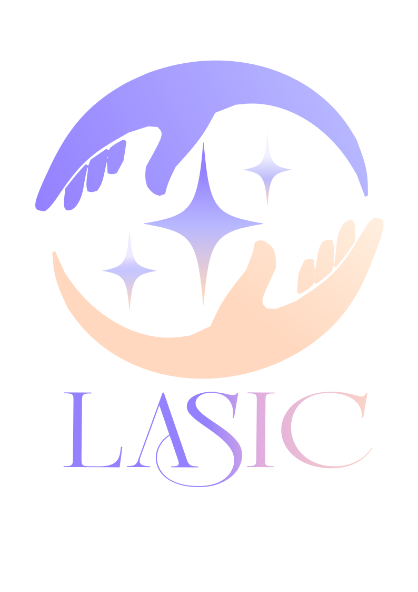

# LASIC
<p align ="center">
    
</p>

<h2 align="center">
Colombian Sign Language Visual Translator using Artificial Intelligence
</h2> 

<p align="center">

Hi I'm shalomfrog, and I created **LASIC** as a project for Hack Club's Macondo program. My goal is to do my part in fostering the inclusion of the Deaf community in Colombia by using computer vision to translate sign language in real time.

You can find me on the Hack Club Slack as: `@shalomfrog`

</p>


LASIC is a system developed in Python that recognizes different signs of Colombian Sign Language (LSC) using Computer Vision and Artificial Intelligence. The system captures real-time video through a webcam, detects the hand using MediaPipe Hands, and classifies the sign performed using a Machine Learning model based on Random Forest trained with custom data.


<h2> Features </h2>

- Real-time recognition of specific signs.
- Automatic hand detection using MediaPipe.
- Classification using Random Forest.
- Graphical User Interface (GUI) developed with CustomTkinter.
- Real-time processing.

# libraries used

| Technology | Function / Role |
|------------|-----------------|
| Python | Main language |
| OpenCV | Video capture and processing |
| MediaPipe Hands | Hand detection |
| Scikit-Learn | Machine Learning model |
| NumPy | Numerical processing |
| Pillow | Image conversion |
| CustomTkinter | Graphical User Interface (GUI) |

## Download the program

You can download the executable version for Windows from the releases section:

[**Download LASIC for Windows**](https://github.com/espinalcorreasalome-star/Nordsign/releases/tag/v1.0.0)

### Usage Instructions

1. Download LASIC-Windows-v1.0.zip.
2. Extract the folder completely.
3. Open the LASIC folder.
4. Run LASIC.exe.

> the executable must remain alongside the _internal folder and the other included files. If the folder is deleted, the executable will not work.

# Installation

<h2> 1. Clone the repository </h2>

```bash
git clone https://github.com/shalomfrog/NORDSIGN.git
```

<h2> 2. Install dependencies </h2>

```bash
pip install -r requirements.txt
```

<h2> 3. Run the application </h2>

```bash
python demo/app.py
```

# Current Status

The system currently recognizes various basic signs of Colombian Sign Language.

The project is still under development, and future versions will include:

- A larger number of signs.
- Model optimization.
- Higher accuracy.
- Full-word recognition.

<p align ="center">
    
</p>


# License

This project is intended for academic and educational purposes.
